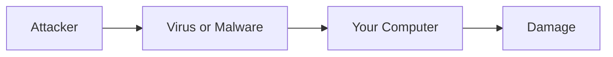
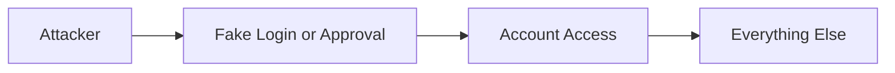
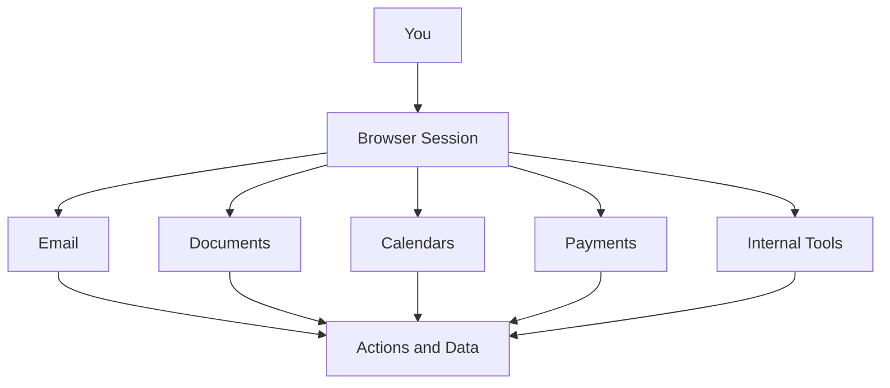
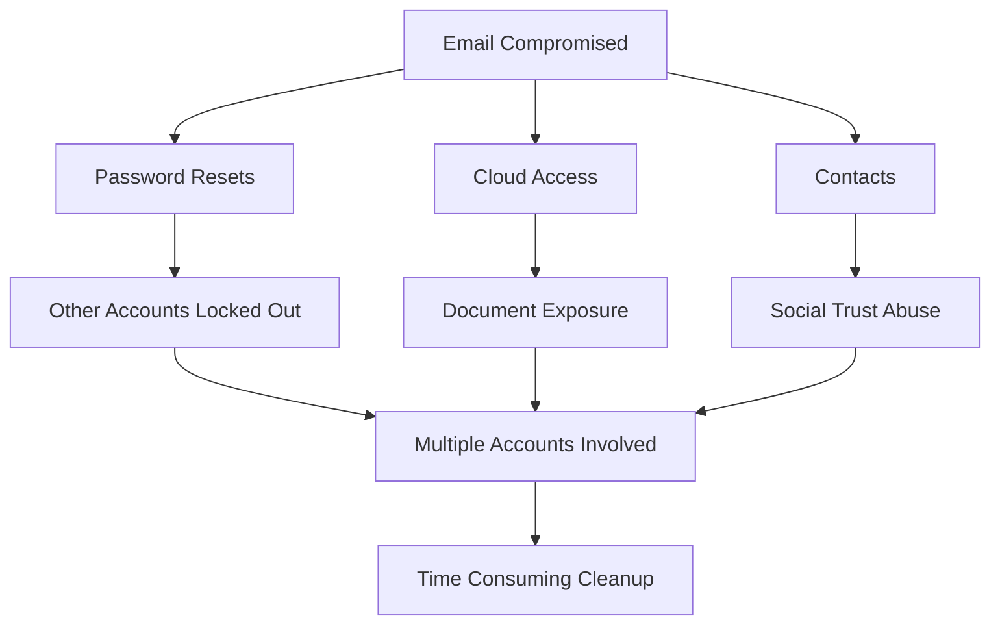
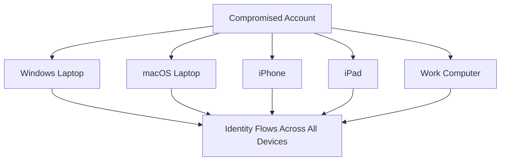
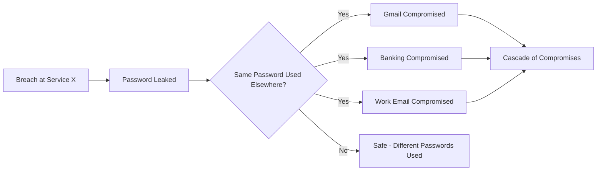
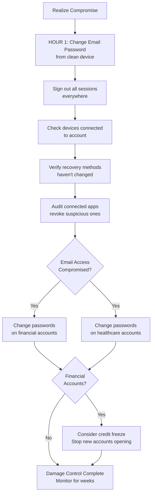

# The Modern Attack Surface: How Computers Get Compromised

This post started with a simple question a friend asked me: which antivirus should I be using?

It made me pause. Not because the question was wrong, but because it assumed an older model of how things go wrong. Before answering, I found myself asking a more basic question instead.

How are machines even getting compromised these days?

Once you really sit with that question, the antivirus conversation starts to feel secondary.

Operating systems are more locked down than they have ever been. Automatic updates are normal. Sandboxing, permissions, and code signing actually work.

And yet compromises are everywhere.

The reason is simple. The attack surface moved. It is no longer centered on the computer itself. It is centered on identity, sessions, and everyday trust.

## The old mental model most of us still have

For a long time, compromise looked straightforward. Something bad landed on your machine, the computer was infected, and the damage lived there.



That model made sense when systems were fragile and defenses were thin. If you avoided sketchy downloads, you were mostly safe.

That world quietly disappeared.

## What compromise usually looks like now

Today, the computer is often fine. The operating system is doing its job. Nothing looks obviously broken.

What fails is access.



Once someone controls an account, they rarely need to touch the device. Email access alone is enough to reset passwords, read private documents, send convincing messages, and stay invisible for a long time.

This works the same way on Windows, macOS, and iOS. The platform matters far less than people think once trust is lost.

## Why browsers quietly became the real operating system

Most of what matters now happens inside a browser. Email, documents, calendars, dashboards, payments, internal tools. That is where work lives and where trust accumulates.



Modern attacks aim for that session, not the computer underneath it.

A fake login page that looks familiar. A browser extension that seemed useful at the time. A stolen session token that never triggers a password prompt.

Once the browser believes you are authenticated, the rest of the system follows along.

## What this feels like as an end user

For most people, compromise does not feel technical. It feels confusing.

You cannot log into an account you used yesterday. You see password reset emails you did not request. Calendar events appear that you never added. Messages are sent from your account that you did not write. A bank asks you to confirm activity you do not recognize.

Nothing screams virus. It just feels like control slipping.

That uncertainty is often the worst part. You stop trusting your own systems. You hesitate on legitimate prompts because everything suddenly looks suspicious.

## Why this keeps cascading once it starts

Once one core account is compromised, others tend to follow quickly.



By the time most people realize something is wrong, multiple accounts are already involved. Cleaning it up becomes time consuming, stressful, and disruptive.

The damage is not always financial. Lost files, missed messages, and impersonation have real personal and professional consequences even when no money is stolen.

## The attack vectors people rarely think about

Many real compromises come from places that feel routine.

Calendar invites carry links and reminders that feel trusted. People accept them reflexively.

OAuth and sign-in flows feel safer than passwords, so people approve access quickly. That access often survives password changes because it was never tied to the password in the first place.

Browser extensions accumulate quietly. They update silently. Permissions stay broad. One compromised extension can observe sessions and modify pages without ever looking like malware.

Recovery paths are often forgotten entirely. Backup email addresses, trusted devices, linked accounts. Attackers do not need to break the front door if the side door is unlocked.

Shared devices create long-lived access in environments that no longer exist. Trust lingers long after context changes.

None of this feels malicious in the moment. That is why it works.

## Where AI makes this harder for normal people

AI did not invent new attacks. It removed friction.

Messages are now fluent, contextual, and emotionally tuned. What used to stand out blends into everyday communication. Small mistakes become easier to make, not because people are careless, but because the signal is harder to distinguish from normal life.

AI also enables adaptive interaction. Instead of a single scam message, attacks can unfold as conversations that respond naturally to hesitation or questions.

At the same time, AI tools are becoming part of daily workflows. People paste sensitive information into them without much thought. They authorize access to be helpful or efficient. Each approval feels minor. Collectively, they widen the attack surface in ways most users never map explicitly.

## Why platform choice alone no longer protects you

There is a comforting belief that choosing the right operating system solves most of this. Better defaults help, but they do not solve the core issue.



Identity flows across devices. Once access is compromised, it follows you everywhere.

This is why people feel blindsided after doing everything right. Updates were installed. Sketchy downloads were avoided. None of that mattered once trust was reused upstream.

## Work accounts versus personal accounts

Your work email operates under different rules.

Your employer controls your work account. They can see what you're doing, enforce password changes, require two-factor authentication, and reset your access if needed. Your IT department will notice if someone is using it from a strange location or accessing unusual data. But you have less control over recovery if something goes wrong.

Work account compromise is worse in different ways. An attacker gains access to your company's data, your coworkers, and potentially customer information. The problem spreads beyond you.

Personal accounts are yours to protect or neglect. No one is watching. You control recovery, but you're also alone in defending it.

Protect your work account like it matters to everyone else, because it does. Use the strongest authentication your employer allows. Don't reuse that password anywhere. Assume it's being monitored. If you suspect it's compromised, tell IT immediately.

Your personal accounts matter more to you than anyone else will ever know. That responsibility is entirely yours.

## So where does antivirus fit now

Antivirus still has a place. It helps catch known malicious software and obvious bad installers, especially on Windows.

It just is not what usually saves people anymore.

Most modern compromises do not involve infecting the machine at all. They involve inheriting access. Antivirus cannot stop you from logging into the wrong place or approving the wrong thing.

It is a seatbelt, not the steering wheel.

## Understanding data breaches

When you hear that a service you use suffered a data breach, it's worth understanding what that actually means.

A breach means attackers got data that shouldn't be public. If it's a password, that password is now known. If it's your email and password together, that combination is in a list somewhere that gets shared and tested against other services.



Check if you're in a known breach at haveibeenpwned.com. Enter your email and you'll see which services leaked your information. This is useful. Not panic-inducing. Just useful.

A breach is past tense. Your password was leaked in 2018. That doesn't mean someone is using it now. But if you reused that password on other sites, those accounts are exposed.

This is why password reuse is so dangerous. One old breach at some forgotten service becomes a key to your email, banking, or work accounts years later.

The action is simple. If you were in a breach for a service that knows your password, change it. If you used the same password elsewhere, change those too. If the breached service offered two-factor authentication and you didn't use it, enable it now.

Most people are in multiple breaches. You probably are too. That's normal. The breach that matters is the one you don't know about yet. The one where you kept the same password everywhere.

## Spotting compromise before it spirals

There are early signals before the damage becomes obvious.

Check your account activity periodically. Most email and cloud services show where you're signed in and recent login locations. An unfamiliar city or device in that list is a genuine warning sign.

Recovery email or phone number changes are a red flag. If you suddenly can't use your backup email to reset a password, someone may have changed it. Same with linked phone numbers or authentication apps.

Connected apps and permissions creep slowly. Services like Google and Microsoft show what third-party apps have access to your account. If you see apps you don't recognize, or apps with permissions you don't remember granting, revoke the access. It's usually one click.

Two-factor authentication breaks the account takeover chain. If someone has your password but not your phone, they still can't get in. That friction is what stops most attacks.

## Behaviors that expose you more than others realize

Reusing passwords across sites means one breach ripples everywhere. A breach at some obscure service leaks credentials that work on Gmail or your bank. Password managers let you use different passwords everywhere without memorizing them.

Approving account access without reading what's being requested is risky. That app asking for "calendar and email access" might only need one of those. Read the request before clicking approve.

Public WiFi creates a different problem than it used to. The WiFi itself isn't the issue. The issue is attackers intercepting login traffic. VPNs help, but real protection comes from password managers autofilling credentials and services using encryption. Don't manually type passwords on public WiFi.

Clicking links in emails, even from people you know, is riskier now. Those emails can be impersonated or accounts can be compromised. If something seems unusual, go directly to the website instead of clicking the link. Especially with financial and account management emails.

## Anti-patterns: What NOT to do

Some habits feel convenient but directly enable compromise.

Do not share passwords with family members, even in emergencies. Once shared, you lose control. You can't change it without inconveniencing them. If they're compromised, so are you. If they leave or your relationship changes, you have a password you never reset. Use family plans or shared password vaults instead.

Do not write passwords down and leave them accessible. A notebook on your desk, a sticky note in your wallet, or a note in your phone is worse than a password manager. No encryption. No backup. No way to update everywhere at once.

Do not use the same password or PIN pattern across accounts. This is the core vulnerability that breaks everything. One breach becomes an attack on all your accounts.

Do not disable security notifications or two-factor authentication because they're inconvenient. They're inconvenient by design. That inconvenience is what stops attackers.

Do not ignore unusual activity emails from your accounts. Check them. If they're real, you need to know. If they're phishing, at least you're awake and can respond.

Do not grant app permissions you don't understand. That app asking for "calendar and email access" can now see every conversation you've had and every meeting you're attending. Read what's being requested. It should match what the app does.

Do not type passwords on public WiFi. The WiFi isn't the vulnerability. The vulnerability is someone intercepting your login. Use a password manager so it autofills, or wait until you're home.

Do not leave old accounts open and forgotten. An old email you don't use, an old social media account, a service you abandoned. These become recovery paths for attackers. Delete them or change their passwords if deletion isn't possible.

## For families and less technical users

Shared accounts with family are riskier than they seem. A shared Netflix account is fine. A shared email or cloud account is a serious risk because anyone with access can reset other accounts.

Children's accounts should be separate, even if they're young. An account a 10-year-old uses for school shouldn't be shared with the whole family.

Elderly or less tech-savvy family members are often targeted specifically. Attackers know they're less likely to recognize phishing or social engineering. If a parent or grandparent is asking you to help verify their account, double-check the request actually came from that service.

Support channels become attack vectors when attackers impersonate them. A call claiming to be from your bank asking you to verify information should be treated as suspicious. Legitimate support never asks for passwords.

## Mobile-specific reality

The line between apps and accounts is blurrier on mobile. An app installed from your app store has permissions to see your location, contacts, photos, calendar, and more. If the app is compromised, that's a live connection to your personal information.

Sign-in-with-Google or sign-in-with-Apple defaults are convenient but they also mean that Google or Apple now has another connection tracking what you're doing. More importantly, if someone compromises your account, they get access to every app you've signed into that way.

Android and iOS protect you in different ways, but both flow personal data through your account. The account is still the single point of failure.

## What actually helps

```
PRIORITY ACTIONS FOR ACCOUNT SECURITY
═════════════════════════════════════════════════════

✓ Two-factor authentication
  Use it on email, cloud storage, and banking
  Most effective defense against account takeover
  
✓ Password manager (Chrome or Apple Keychain)
  Generate random passwords automatically
  Never reuse passwords across sites
  
✓ Audit connected apps
  Periodically check what has access to your account
  Revoke anything suspicious
  
✓ Monitor account activity
  Check unusual login locations and devices
  Pay attention to reset emails you didn't request
  
✓ Backup authentication methods
  Recovery email, phone number, recovery codes
  Stored safely in case you get locked out
  
═════════════════════════════════════════════════════
What doesn't help as much anymore: antivirus software,
avoiding downloads, keeping a clean system.

Those still help, but they don't solve the modern problem.
```

## How to actually implement this

The biggest gap between understanding the problem and staying safe is actually doing something about it.

Don't reuse passwords. Use the password manager built into your browser or phone. You already have it.

**INSECURE vs. SECURE PASSWORD STORAGE**

```
❌ INSECURE - Do NOT do these:
═════════════════════════════════════════════════
Email to yourself      → Unencrypted, accessible to anyone with email
Desktop text file      → No encryption, visible to anyone with access
Notebook at desk       → Physical security issue, can be photographed
Spreadsheet            → Centralized, unencrypted, ripple effect if stolen
Same password reused   → One breach = all accounts compromised
Phone photo of note    → Backed up to cloud, searchable


✓ SECURE - Do these:
═════════════════════════════════════════════════
Chrome Password Manager    → Encrypted, syncs across devices, autofills
Apple Keychain            → Encrypted, syncs across Apple devices
Generated random password → Let the manager create it, never memorize
Different password per site → One breach doesn't cascade to other accounts
Auto-fill enabled         → Never type password manually, especially on WiFi
```

If you use Chrome or Android, use the password manager that comes with it. If you use Apple devices, use Keychain. Both work everywhere. Both are encrypted. Both sync across your devices. You don't need anything else.

When you create a password on a website, let the password manager generate a random one. Don't come up with it yourself. Don't try to make it memorable. The whole point is that you never have to remember it or type it. The password manager fills it in.

The temptation is to reuse a password you already know because it feels simpler. It's not. It's the opposite. One breach leaks that password everywhere.

Never email yourself a password. Never write it in a note on your desktop or phone. Never keep a spreadsheet of passwords. These are worse than reusing the same password because they're unencrypted and centralized.

For critical documents, use a combination of physical and digital storage.

**CRITICAL DOCUMENTS STORAGE STRATEGY**

```
ORIGINAL DOCUMENTS (Physical)
═════════════════════════════════════════════════
  Birth Certificate
  Passport
  Property Deeds
  Insurance Policies
  
  ↓ STORE IN ↓
  
  □ Safe deposit box at bank
  □ Personal safe at home (fireproof)
  □ NOT on desk, NOT easily accessible


DIGITAL COPIES (Encrypted Cloud)
═════════════════════════════════════════════════
  Scan originals or take photos
  Store in encrypted cloud storage:
  
  ✓ Google Drive (with 2FA enabled)
  ✓ Microsoft OneDrive (with 2FA enabled)
  ✓ iCloud (with 2FA enabled)
  
  Enable two-factor authentication on the account
  Access from anywhere, backed up automatically


RECOVERY CODES (Physical Backup)
═════════════════════════════════════════════════
  Print recovery codes from 2FA setup
  Write them down (if preferred)
  
  ✓ Store in safe or safe deposit box
  ✗ NOT in desk drawer
  ✗ NOT as phone photo
  ✗ NOT unencrypted notes


═════════════════════════════════════════════════
PATTERN: Don't rely on single location
         Don't sacrifice security for access
         Multi-layer physical + digital backup
```

Critical documents: birth certificates, passports, insurance policies, property deeds, medical records, financial statements. Keep the originals in a physical safe or safe deposit box. Scan them or take photos and store the digital copies in cloud storage like Google Drive, Microsoft OneDrive, or iCloud with two-factor authentication enabled on that account.

Don't keep important documents on your desktop or in random folders. Don't email them to yourself as attachments. Don't store them on a USB drive left in a drawer.

For recovery codes from two-factor authentication, print them out or write them down and store the physical copy in a safe place. A safe or safe deposit box. Not in a desk drawer. Not a photo on your phone.

The pattern is the same: don't rely on a single location. Don't trust convenience over security. Don't store sensitive information in places that feel easy to access but aren't actually protected.

## If you realize you're compromised

Act fast. The first 24 hours matter.



**Step by step:**

1. Change your email password immediately from a clean device (computer you know hasn't been compromised). Email is your master key.

2. Sign out all sessions. Most email and cloud services have an option to sign out everywhere at once.

3. Check what devices are signed in and revoke any you don't recognize.

4. Verify your phone number and recovery options haven't been changed. If they have, compromise is more serious.

5. Check what apps have connected to your account and revoke access to anything suspicious.

6. If your email was compromised, assume other accounts with similar passwords are at risk. Change passwords on financial accounts, healthcare, and anything important.

7. Consider freezing credit if financial accounts are involved. This stops attackers from opening accounts in your name.

## The real shift to internalize

Modern compromise is rarely about broken software. It is about normal behavior becoming predictable.

Logging in. Approving access. Staying signed in. Reusing trust across contexts.

These are not technical actions. They are everyday habits. That is why they are so easy to exploit.

## Closing thought

If modern compromise feels unfair, it is because the rules changed quietly.

Your computer did not suddenly become unsafe. The way trust moves through your digital life did.

Once you start thinking in terms of identity, sessions, and approvals, these incidents stop feeling mysterious. They start feeling structural.

Not because systems are weak, but because trust is easier to steal than code is to break.

---

## Visual Assets (Placeholders for images)

The following sections could benefit from custom designed images/icons:

- **[IMAGE PLACEHOLDER 1]** - Illustration of old attack model (virus → computer → damage) vs new model (fake login → account → everything)

- **[IMAGE PLACEHOLDER 2]** - Icon set showing the five key protections (2FA, password manager, app audit, activity monitoring, recovery methods)

- **[IMAGE PLACEHOLDER 3]** - Visual comparison of password storage methods (email vs. notes vs. password manager)

- **[IMAGE PLACEHOLDER 4]** - Timeline or infographic showing compromise cascade (email → passwords → cloud → contacts)

- **[IMAGE PLACEHOLDER 5]** - Device ecosystem diagram showing how one compromised account affects all devices

- **[IMAGE PLACEHOLDER 6]** - Safe/security imagery for document storage strategy